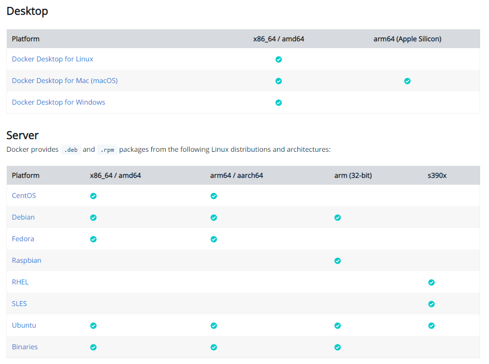
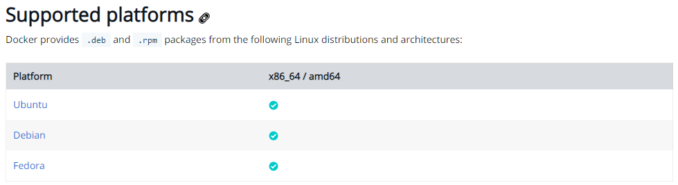
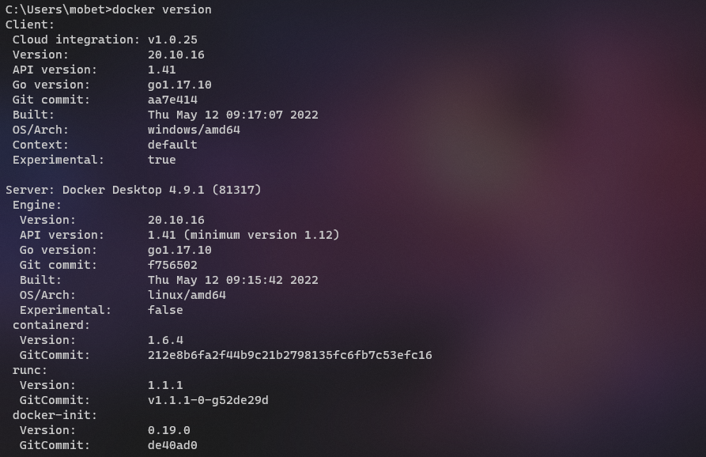

# How to Docker

:green_book: **Chapter Objectives**

* 如何開始 Docker

:blue_book: **Reference**

* [Install Docker Engine](https://docs.docker.com/engine/install/)
* [Windows Subsystem for Linux](https://docs.microsoft.com/zh-tw/windows/wsl/)
* [比較 WSL 1 和 WSL 2](https://docs.microsoft.com/zh-tw/windows/wsl/compare-versions)

## 安裝

看官方文件安裝最快 [這裡](https://docs.docker.com/engine/install)  


* 選擇作業系統
  * Linux  
    跟著步驟把 Server 跟 Client 都安裝起來
  * Windows  
    要特別注意 Windows 用什麼來啟動 Docker  
    現在的主流是 WSL2(Windows Subsystem for Linux)  
    但有的版本 WSL2 要自己建置  

    :notebook: <font color="#008000">** WSL補充**</font>  
    * Windows Subsystem for Linux [這裡](https://docs.microsoft.com/zh-tw/windows/wsl/)  
    * WSL1 VS WSL2 比較 [這裡](https://docs.microsoft.com/zh-tw/windows/wsl/compare-versions)
* 是否要使用 Desktop  

  ※ Install Docker Desktop on Linux  
  ※ Docker Desktop on Linux 要注意一下支援的平台  
    

## Hello World

安裝後可以用 `docker version` 確定一下是否成功

```sh
docker version
```

* Windows docker version

  

* Linux docker version

  

```sh
docker run hello-world
```
