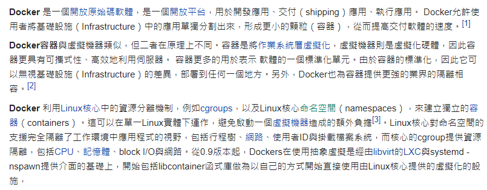
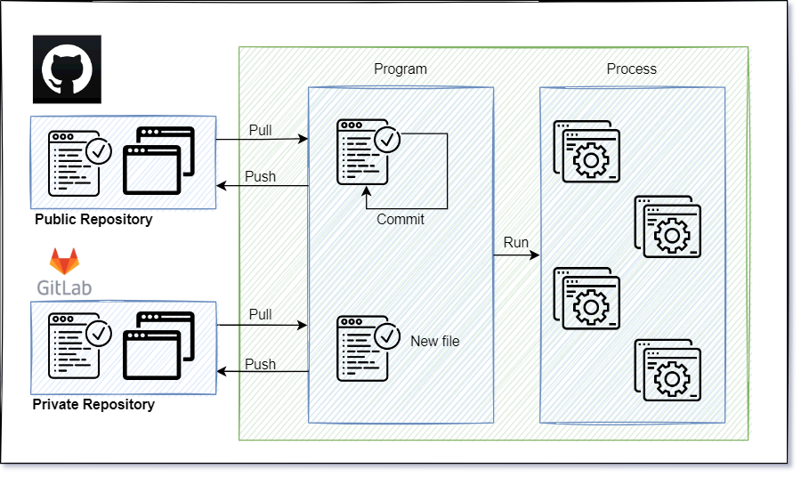
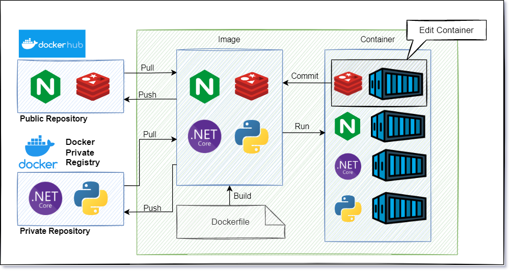

# What is Docker

:green_book: **Chapter Objectives**

* 知道 Docker 是什麼

:blue_book: **Reference**

* [Wiki Docker](https://zh.wikipedia.org/zh-tw/Docker)

:closed_book:  **Notice**

* Images = 鏡像 = 映像檔
* Containers = 容器
* Registry = 倉庫

## Docker 是什麼

關於這點 Wiki 上面對於 Docker 的介紹，基本上足夠優秀了 [Wiki Docker](https://zh.wikipedia.org/zh-tw/Docker)  

如同學習英文需要記住的 A,B,C  
學習 Docker 最基本關鍵字也要記住: Images,Containers,Registry  
這邊整理幾個關鍵字，如下:  

* Docker Engine
* **Docker registry**
* Docker Objectives
  * **Containers**
  * **Images**
  * Networks
  * Volumes
* Dockerfile
* Docker Compose
* ~~Docker Swarm~~ (有能力請直上 K8S)
* Docker Networking
  * bridge
  * host
  * none
* Manage data in Docker
  * volumes
  * bind mounts:
  * tmpfs mounts

## Docker 概述

關於入門 Docker 這件事，本身是用 Git 來幫助自己理解  
比較一下兩者的用法其實差不多!?  
大致上的流程都是差不多的  

* Git 簡略使用流程  

  

* Docker 簡略使用流程

  

自身使用上的流程比較如下  
特別注意的是 Docker 也可以用 Dockerfile 來建置 Images:  

Action | Git               | Docker
-------|-------------------|----------------
1      | 從倉庫拉取程式碼  | 從倉庫拉取映像檔
2      | 編輯程式碼        |
3      | 執行程式碼        | 執行映像檔
4      | 程式運行中        | 容器運行中
5      |                   | 編輯容器內容
6      | Commit 已變更區塊 | 將容器 Commit 成映像檔
7      | 提交程式回倉庫    | 提交映像檔回倉庫

## Docker 基本

Docker 的三項之力  
以下來自 Wiki 言簡意賅毫無吐槽點，真的寫得很好  

* **Image**  

  一個唯讀模板，用於指示建立容器

* **Container**  

  是鏡像的可執行的實例，容器可通過API或CLI（命令列）進行操控

* **Registry**  

  Docker註冊中心(Docker registry)是用於儲存 Docker鏡像
