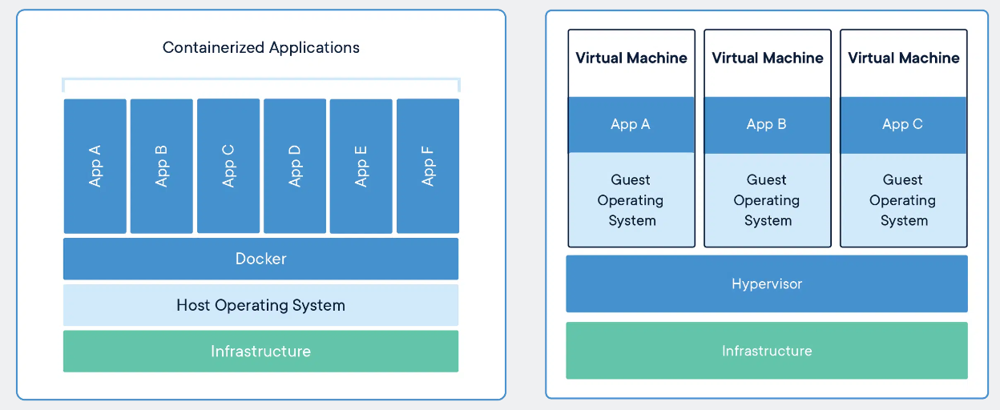

# Why Docker

:green_book: **Chapter Objectives**

* 知道為什麼要使用 Docker

## 為什麼用 Docker

自己使用過 Docker 後的心得，如果要濃縮成一句話來說就是  
**「你的 Docker 真方便」**  
以開發程式為主的~~碼農~~工程師(我的)角度來看  
假設今天開發的系統中用到的元件有  
  
* Redis 當作緩存  
* MySQL 當資料庫  
* RabbitMQ 當資料轉發  
  
如果三個服務都要工程師自架，那是天昏地暗  
更不要說有時候要搭一個群集(ex redis cluster)來測試  
那是毀天滅地等級的苦難  
如果使用 Docker  
啟動 Redis 一行指令；啟動 MySQL 一行指令；啟動 RabbitMQ 再一行指令  
啟動群集一行指令加上 Docker Compose，重點是還可以**重複使用**  
使用 Docker 可以非常輕鬆的建構出需要的開發環境  
至於那些可以餵狗查到的優點就不一一說明了  

* **快速的交付、部屬**
* **有效的虛擬化**
* **輕鬆的擴展、遷移**
* **簡單的管理**

## Docker 與虛擬機的比較

這個也是講到爛掉的議題了  
Google "docker vs virtual machine" 會有一堆  
Stackoverflow 上面有一個破千推的討論非常實用 [傳送門](https://stackoverflow.com/questions/16047306/how-is-docker-different-from-a-virtual-machine)  
亦或是官方網站 [傳送門](https://www.docker.com/resources/what-container/#/package_software)  
非常經典的一張圖來自 Docker 官方  
但真正的感受到 Docker 與虛擬機的不同，是在自己去瀏覽過 Docker 底層的原始碼後  
對 Docker Engine 如何啟動容器有初步的概念，才比較能體會其中奧妙之處
不過容器也不一定完全可以替代虛擬機  
容器與虛擬機兩者各有優缺點，就看使用者怎麼使用了  
自身理解是若以軍隊比喻，Docker 像是空軍，虛擬機像是陸軍&nbsp;  
各有擅長的地方  

