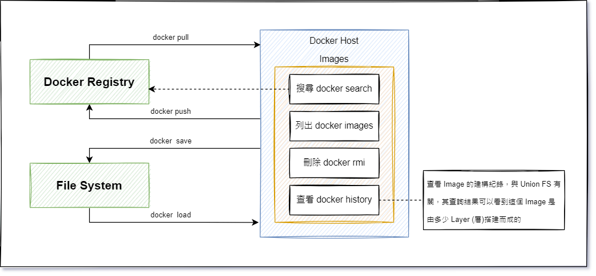

# Image 基本操作

:green_book: **Chapter Objectives**

* Image 如何搜尋
* Image 基本使用
  * 拉取
  * 查找
  * 匯出/匯入
  * 刪除

:blue_book: **Reference**

* [Docker —— 從入門到實踐](https://github.com/philipz/docker_practice)

:closed_book:  **Notice**

* 尚無

:pencil2: **Quick Guide**  

## Pull Image 拉取