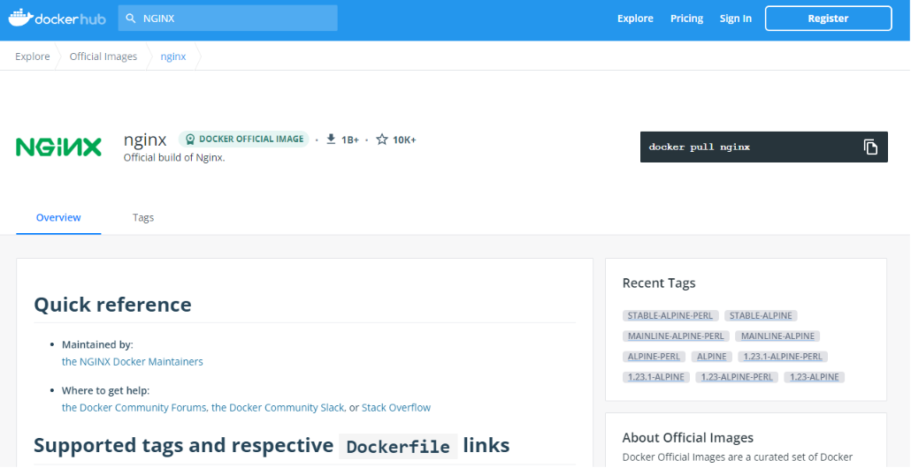

# Image 基本操作

:green_book: **Chapter Objectives**

* Image 如何搜尋
* Image 基本使用
  * 拉取
  * 查找
  * 匯出/匯入
  * 刪除

:blue_book: **Reference**

* [Docker pull](https://docs.docker.com/engine/reference/commandline/pull/)
* [Docker —— 從入門到實踐](https://github.com/philipz/docker_practice)

:closed_book:  **Notice**

* 以下環境為 Window 10

:pencil2: **Quick Guide**  


## 拉取

如同 Git 從遠端倉庫拉取程式碼，Docker 則默認從 Docker hub 拉取映像檔  
可以使用指令 `docker pull` 來進行映像檔拉取  
透過 `docker pull --help` 可以看到詳細訊息

```sh
docker pull [OPTIONS] NAME[:TAG|@DIGEST]
```

格式為 `docker pull [選項] [Docker Registry[:Port]/]Registry Name[:Tag]`  
最基本的用例為  

```sh
docker pull hello-world
```

若不指定 Tag 版本則下載最新版本 latest  
在官方的 Docker Registry，若要建立自己的映像檔會在前面再加上自己的用戶  
例如 `docker pull mobetax81072/itdapi`  
就是到我自己的 dockerhub 下拉取 itdapi 這個映像檔  

舉例：

* `docker pull nginx`

  會到預設 registry.hub.docker.com 下載最新 nginx image
  因為這行實際執行的是 `docker pull registry.hub.docker.com/nginx`

* `docker pull nginx:alpine`

  會下載 alpine 版本的 nginx image

* `docker pull nginx:1.22.0`

  會下載 1.22.0 版本的 nginx image

* `docker pull docker.elastic.co/elasticsearch/elasticsearch:8.3.3`

 不使用預設的 Registry 這裡會去 docker.elastic.co/elasticsearch/ 下載 elasticsearch 8.2.2 版本

* :notebook: <font color="008000">**Pull from a different registry 補充**</font>

    

  Docker 默認使用 https，如果要用 http 要去改設定

## 搜索

使用指令搜尋 `docker search`

```sh
docker search nginx
```


我是GUI廢人所以通常上官網看 囧  

* DOCKER OFFICIAL IMAGE 為官方認證通常不用加用戶前墜
* 右邊有星星數 跟 下載數量
* TAG 通常會顯示平台


* 右上角直接複製使用最快
* 可以到 Tags 裡面看看有什麼其他的版本
* 一個好的 Registry Overview 通常會有完善的使用說明(參數，注意事項)



## 列出本地

使用指令搜尋本地的映像檔 `docker images`  
&nbsp;  
&nbsp;  

```sh
C:>docker images
REPOSITORY                                      TAG       IMAGE ID       CREATED        SIZE
bitnami/nginx                                   latest    b5c8aca1173f   2 days ago     101MB
mobeloadbalanceweb                              latest    3a4b2c20cb36   3 weeks ago    231MB
mobeloadbalanceweb                              dev       2e3a11311015   3 weeks ago    208MB
nginx                                           latest    55f4b40fe486   7 weeks ago    142MB
docker.elastic.co/elasticsearch/elasticsearch   7.17.1    515ab4fba870   5 months ago   618MB
docker.elastic.co/beats/filebeat                7.17.1    7f2b5e7dd9ef   5 months ago   268MB
docker.elastic.co/logstash/logstash             7.17.1    6867cdc68606   5 months ago   783MB
docker.elastic.co/kibana/kibana                 7.17.1    8fbc840d074f   5 months ago   895MB
```

## 匯出和匯入

匯出 Image `docker save -o [檔案位置] [IMAGE...]`  
匯入 Image `docker load -i [檔案位置]`  

## 移除

使用指令移除本地映像檔 `docker rmi [OPTIONS] IMAGE [IMAGE...]`  
&nbsp;  
&nbsp;  

```sh
C:>docker rmi redis
Untagged: redis:latest
Untagged: redis@sha256:9bc34afe08ca30ef179404318cdebe6430ceda35a4ebe4b67d10789b17bdf7c4
Deleted: sha256:3e42dd4e79c7b6e416d06dde0de3e8b6cc73bf8f59dea9d3f784ac63cf4665a9
Deleted: sha256:93776ad7e2c55350f03d3280a941f7e2a224b2f316ac55920482ae9e9c957af7
...
```

## 歷史訊息

使用指令查看本地映像檔建構歷史 `docker history [OPTIONS] IMAGE`  
&nbsp;  
&nbsp;  

```sh
C:>docker history redis
IMAGE          CREATED       CREATED BY                                      SIZE      COMMENT
3e42dd4e79c7   2 weeks ago   /bin/sh -c #(nop)  CMD ["redis-server"]         0B
<missing>      2 weeks ago   /bin/sh -c #(nop)  EXPOSE 6379                  0B
<missing>      2 weeks ago   /bin/sh -c #(nop)  ENTRYPOINT ["docker-entry…   0B
<missing>      2 weeks ago   /bin/sh -c #(nop) COPY file:e873a0e3c13001b5…   661B
<missing>      2 weeks ago   /bin/sh -c #(nop) WORKDIR /data                 0B
...
```
