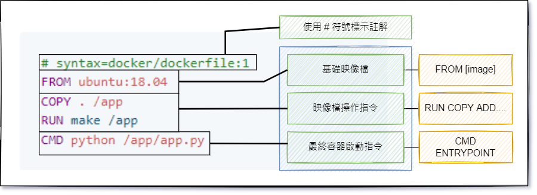

# Dockerfile 基本使用

:green_book: **Chapter Objectives**

* Dockerfile 基本撰寫

:blue_book: **Reference**

* [Dockerfile reference](https://docs.docker.com/engine/reference/builder/)
* [Best practices for writing Dockerfiles](https://docs.docker.com/develop/develop-images/dockerfile_best-practices/)

:closed_book:  **Notice**

## Dockerfile

Dockerfile 主要用來建置映像檔，其內容由一行行的命所組成  
引用官方範例 [Best practices for writing Dockerfiles](https://docs.docker.com/develop/develop-images/dockerfile_best-practices/)

```yml
# syntax=docker/dockerfile:1
FROM ubuntu:18.04
COPY . /app
RUN make /app
CMD python /app/app.py
```

主要分成三個部分

* 基礎映像檔
* 操作映像檔
* 啟動容器指令



## 指令

比較常用的幾個如下：

| 指令       | 說明                    |
|------------|-------------------------|
| FROM       |                         |
| RUN        |                         |
| ENTRYPOINT |                         |
| CMD        |                         |
| COPY       |                         |
| ADD        |                         |
| ENV        |                         |
| EXPOSE     |                         |
| WORKDIR    |                         |
| MAINTAINER | 已經棄用使用 label 取代 |

